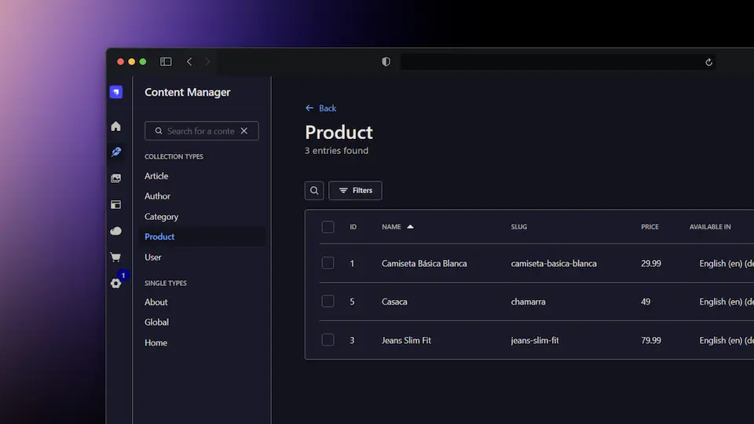

# 🛒 Tienda Online - Backend con Strapi

<p align="center">
  
</p>

Este es el backend de nuestra tienda online desarrollado con **Strapi** y **GraphQL**. Strapi proporciona una API robusta y flexible para gestionar productos, usuarios, pedidos y toda la funcionalidad necesaria para el e-commerce.

## 🚀 Comandos de desarrollo

### `develop`

Inicia la aplicación Strapi con autoRecarga habilitada. [Más información](https://docs.strapi.io/dev-docs/cli#strapi-develop)

```bash
npm run develop
# o
yarn develop
```

### `start`

Inicia la aplicación Strapi con autoRecarga deshabilitada. [Más información](https://docs.strapi.io/dev-docs/cli#strapi-start)

```bash
npm run start
# o
yarn start
```

### `build`

Construye el panel de administración. [Más información](https://docs.strapi.io/dev-docs/cli#strapi-build)

```bash
npm run build
# o
yarn build
```

## 🛍️ Funcionalidades de la Tienda

- **Gestión de Productos**: Crear, editar y eliminar productos con imágenes, descripciones y precios
- **Gestión de Usuarios**: Registro, autenticación y perfiles de clientes
- **Gestión de Pedidos**: Procesamiento y seguimiento de pedidos
- **Categorías**: Organización de productos por categorías
- **Inventario**: Control de stock y disponibilidad
- **API GraphQL**: Endpoints optimizados para consultas complejas

## 🔧 Configuración GraphQL

Strapi incluye soporte nativo para GraphQL. Para habilitarlo:

1. Instala el plugin de GraphQL:

```bash
npm install @strapi/plugin-graphql
# o
yarn add @strapi/plugin-graphql
```

2. Reinicia el servidor de desarrollo
3. Accede al playground GraphQL en: `http://localhost:1337/graphql`

## ⚙️ Despliegue

Strapi ofrece múltiples opciones de despliegue incluyendo [Strapi Cloud](https://cloud.strapi.io). Consulta la [sección de despliegue de la documentación](https://docs.strapi.io/dev-docs/deployment) para encontrar la mejor solución para tu caso de uso.

```bash
yarn strapi deploy
```

## 📚 Recursos útiles

- [Centro de recursos](https://strapi.io/resource-center) - Centro de recursos de Strapi
- [Documentación de Strapi](https://docs.strapi.io) - Documentación oficial de Strapi
- [Tutoriales de Strapi](https://strapi.io/tutorials) - Lista de tutoriales del equipo core y la comunidad
- [Blog de Strapi](https://strapi.io/blog) - Blog oficial con artículos del equipo y la comunidad
- [Changelog](https://strapi.io/changelog) - Actualizaciones de producto, nuevas características y mejoras

¡No dudes en revisar el [repositorio de GitHub de Strapi](https://github.com/strapi/strapi). ¡Tus comentarios y contribuciones son bienvenidos!

## ✨ Comunidad

- [Discord](https://discord.strapi.io) - Únete al chat con la comunidad de Strapi incluyendo el equipo core
- [Foro](https://forum.strapi.io/) - Lugar para discutir, hacer preguntas y encontrar respuestas
- [Awesome Strapi](https://github.com/strapi/awesome-strapi) - Lista curada de cosas increíbles relacionadas con Strapi

---

<sub>🤫 ¡Psst! [Strapi está contratando](https://strapi.io/careers).</sub>
