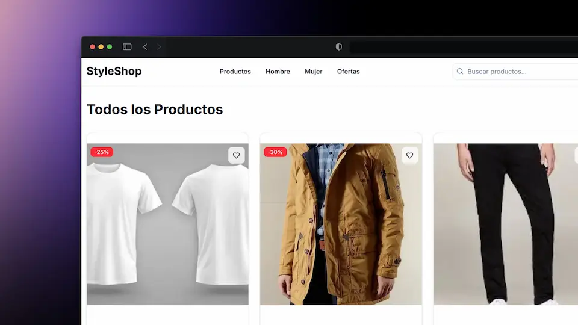

# 🛍️ Tienda Online - Frontend

<p align="center">
  
</p>

Una aplicación web moderna de comercio electrónico construida con Next.js 15, TypeScript y GraphQL. Esta tienda online ofrece una experiencia de compra fluida con funcionalidades como catálogo de productos, carrito de compras, y gestión de pedidos.

## ✨ Características

- **🛒 Catálogo de Productos**: Navegación por categorías y productos destacados
- **🔍 Búsqueda y Filtros**: Encuentra productos fácilmente
- **🛍️ Carrito de Compras**: Gestión completa del carrito con persistencia
- **📱 Diseño Responsivo**: Optimizado para dispositivos móviles y desktop
- **🎨 UI Moderna**: Interfaz elegante con Tailwind CSS y Radix UI
- **⚡ Rendimiento Optimizado**: Next.js 15 con Turbopack para desarrollo rápido
- **🔐 Autenticación**: Sistema de usuarios y gestión de sesiones
- **📊 GraphQL**: API moderna y eficiente para datos

## 🛠️ Tecnologías Utilizadas

- **Framework**: Next.js 15.4.2
- **Lenguaje**: TypeScript
- **Estilos**: Tailwind CSS v4
- **UI Components**: Radix UI
- **Estado**: Apollo Client (GraphQL)
- **Iconos**: Lucide React
- **Notificaciones**: Sonner
- **Temas**: next-themes

## 📋 Prerrequisitos

- Node.js 18+
- npm o yarn
- Backend Strapi corriendo en `localhost:1337`

## 🚀 Instalación

1. **Clona el repositorio**

   ```bash
   git clone https://github.com/WillJkdev/online-store-strapi-nextjs.git
   cd tienda-online/frontend
   ```

2. **Instala las dependencias**

   ```bash
   npm install
   # o
   yarn install
   ```

3. **Configura las variables de entorno**
   Crea un archivo `.env.local` en la raíz del proyecto, puedes copiar el archivo `.env.example` y renombrarlo a `.env.local`:

   ```env
   NEXT_PUBLIC_STRAPI_URL=http://localhost:1337
   STRAPI_TOKEN="token_strapi"
   STRAPI_GRAPHQL_API=http://localhost:1337/graphql
   NEXT_PUBLIC_GRAPHQL_API_URL=http://localhost:1337/graphql
   NEXT_PUBLIC_STRAPI_TOKEN="token_strapi_public"
   ```

4. **Genera los tipos de GraphQL**

   ```bash
   npm run codegen
   ```

5. **Inicia el servidor de desarrollo**

   ```bash
   npm run dev
   # o
   yarn dev
   ```

6. **Abre tu navegador**
   Navega a [http://localhost:3000](http://localhost:3000)

## 📁 Estructura del Proyecto

```
src/
├── app/                 # App Router de Next.js
│   ├── cart/           # Páginas del carrito
│   ├── products/       # Páginas de productos
│   └── layout.tsx      # Layout principal
├── components/         # Componentes reutilizables
│   ├── ui/            # Componentes base de UI
│   └── ...            # Componentes específicos
├── context/           # Contextos de React
├── graphql/           # Consultas y mutaciones GraphQL
├── hooks/             # Custom hooks
└── lib/               # Utilidades y configuraciones
```

## 🎯 Scripts Disponibles

- `npm run dev` - Inicia el servidor de desarrollo con Turbopack
- `npm run build` - Construye la aplicación para producción
- `npm run start` - Inicia el servidor de producción
- `npm run lint` - Ejecuta el linter
- `npm run codegen` - Genera tipos de GraphQL

## 🔧 Configuración

### Backend Strapi

Asegúrate de que tu backend Strapi esté corriendo en `localhost:1337` y que tenga configurado:

- GraphQL endpoint habilitado
- Permisos de CORS configurados
- Colecciones de productos y categorías

### Imágenes

El proyecto está configurado para cargar imágenes desde Strapi. La configuración se encuentra en `next.config.ts`.

## 🚀 Despliegue

### Vercel (Recomendado)

1. Conecta tu repositorio a Vercel
2. Configura las variables de entorno
3. Deploy automático en cada push

### Otros proveedores

La aplicación puede ser desplegada en cualquier plataforma que soporte Next.js:

- Netlify
- Railway
- DigitalOcean App Platform

## 🤝 Contribución

1. Fork el proyecto
2. Crea una rama para tu feature (`git checkout -b feature/AmazingFeature`)
3. Commit tus cambios (`git commit -m 'Add some AmazingFeature'`)
4. Push a la rama (`git push origin feature/AmazingFeature`)
5. Abre un Pull Request

## 📄 Licencia

Este proyecto está bajo la Licencia MIT. Ver el archivo `LICENSE` para más detalles.

## 📞 Soporte

Si tienes alguna pregunta o problema, por favor:

- Abre un issue en GitHub
- Revisa la documentación de Next.js
- Consulta la documentación de Strapi

---

Desarrollado con ❤️ usando Next.js y Strapi
